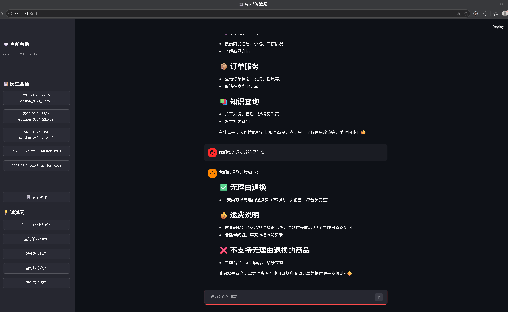

# E-commerce Customer Service Agent

基于 DeepSeek + RAG 的电商智能客服系统，带 Web 对话界面和 MySQL 持久化。

## 在线体验

👉 https://agent-learning-asaxb9aj2rjerieizb3ehk.streamlit.app/

## 项目结构

├── app.py                   # Streamlit 前端页面
├── agent_core.py            # Agent 核心逻辑（工具 + RAG + 对话处理）
├── db_manager.py            # MySQL 数据库操作（对话记录持久化）
├── ingest.py                # 知识库导入脚本（首次运行）
├── knowledge_base.txt       # 知识库源文档
├── requirements.txt         # 依赖清单
└── .env                     # 环境变量（API Key、MySQL）

## 功能

- 商品搜索、订单查询、退换货、取消订单（4 个自定义工具）
- RAG 知识库：发货、售后、发票等政策动态检索
- 别名处理（"苹果15"自动映射到 iPhone 15）
- 对话记录持久化（MySQL，支持历史会话查看）
- 多轮对话记忆

## 技术栈

- 大模型：DeepSeek（OpenAI 兼容接口）
- 前端：Streamlit
- 向量库：ChromaDB
- 数据库：MySQL 8.0
- 嵌入模型：HuggingFace all-MiniLM-L6-v2

## 本地运行

```bash
pip install -r requirements.txt
python ingest.py                  # 导入知识库
streamlit run app.py              # 启动网页界面
```
## 演示截图



