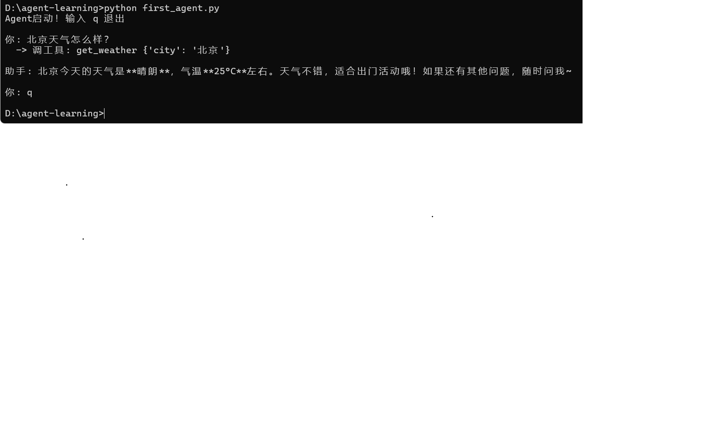

基于 DeepSeek API 的 Agent 工具调用实战项目。

## 项目结构

├── first_agent.py     # 第一个 Agent：天气查询 + 通知发送
├── rag_bot/           # RAG 文档问答系统（开发中）
│   ├── ingest.py      # 文档导入与向量化
│   └── query.py       # 检索问答入口
└── ecommerce_agent/   # 电商智能客服 Agent（开发中）

## 技术栈

- 大模型：DeepSeek（通过 OpenAI 兼容接口调用）
- 框架：LangChain
- 向量库：ChromaDB
- 后端：FastAPI

## 项目 1：Agent 工具调用

实现了基于 function calling 的智能助手，支持多轮对话和工具调度。

支持的工具：
- 天气查询（模拟）
- 通知发送（模拟）

运行方式：
pip install openai
python first_agent.py

## 运行效果

## 项目 2：RAG 问答系统（进行中）

基于检索增强生成，支持对本地文档进行自然语言问答。

## 联系方式

- GitHub：https://github.com/Pariond/agent-learning

