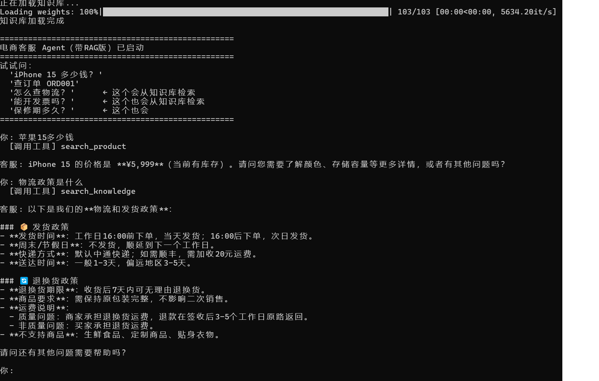

# E-commerce Customer Service Agent

基于 DeepSeek + RAG 的电商智能客服系统。

## 项目结构

├── customer_service_agent.py   # 主程序：工具调用 + RAG 知识检索
├── ingest.py                   # 知识库导入脚本（首次运行）
├── knowledge_base.txt          # 知识库源文档
├── first_agent.py              # 第一个 Agent 练习项目
├── chroma_db/                  # 向量数据库（由 ingest.py 生成）

## 功能

- 商品搜索、订单查询、退换货政策、取消订单（4 个自定义工具）
- RAG 知识库：发货、售后、发票等政策动态检索，政策变更只需改文档
- 多轮对话记忆

## 运行方式

pip install openai langchain-community chromadb sentence-transformers
python ingest.py                       # 首次运行，导入知识库
python customer_service_agent.py       # 启动客服

## 演示截图

## 技术栈

- 大模型：DeepSeek（通过 OpenAI 兼容接口调用）
- Agent 框架：LangChain
- 向量库：ChromaDB
- 语言：Python

## 联系方式
- 成品展示网站：https://agent-learning-asaxb9aj2rjerieizb3ehk.streamlit.app/
- GitHub：https://github.com/Pariond/agent-learning